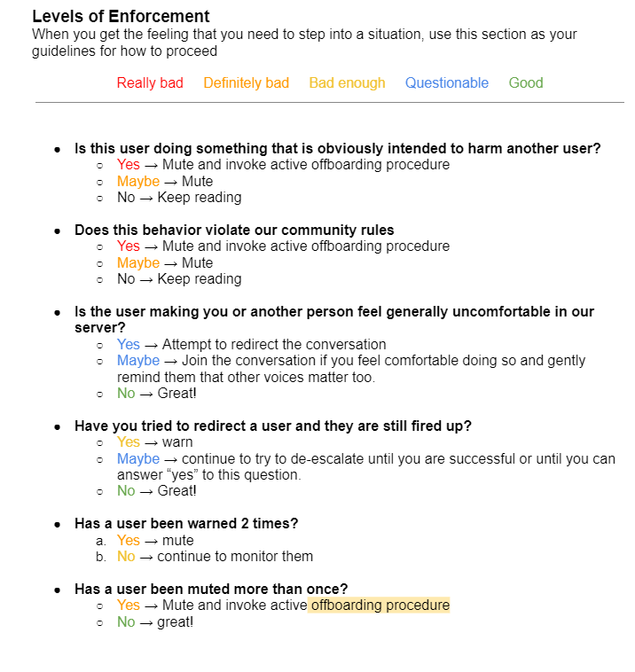
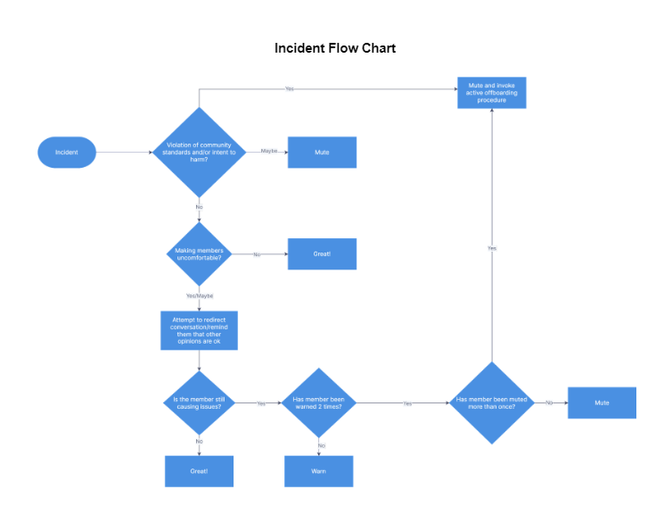

## Community Moderation committee
A sub team under the Operations team of the SuperUMAn DAO
## Functions of the Community Moderation committee
- Implementations of community rules and guidelines
- Responsible for moderating poor behavior and taking action as required
- In charge of dispute resolution and mediation
## Mission and vision statement to be followed as a guides to rules implementation 
**Mission Statement**

The core mission of the SuperUMAns is to communicate the true power of universal access to markets and its benefits to the world. 

**Vision**

“Attaining universal access to markets is almost like learning a language. And it's up to us to figure out how to say beautiful things with it.”

From the SuperUMAn DAO DESIGN PRINCIPLES

## Who can  be a Community Moderator

- They have to be Core SuperUMAns and UMAsters
- They should also have roles directly involved with the people ( for example’ Onboarders role, Operations masters role and Team lead)
- Must have been a [Core] SuperUMAn or higher for 2 Epochs or more (including pre-DAO epochs)

## Criteria for being a Community Moderator

- They must have great knowledge of the SuperUMAn culture
- Emotional Intelligence; must be aware that emotions of people are involved when settling disputes, must know how to control one’s emotion when handling a case.
- Must emulate the core values of the DAO.

## Do we need a Community Moderator’s  channel
“Yes we do”
Some matters are meant to be discussed and handled privately

NB; The DAO is meant to know how matters are handled so what we can do while handling a dispute is to give the DAO the cause of the argument and why it was handled that way. 
(Agreed, we can allow members to see what's going on (read-only permissioned channel) while the write perm be given to Comm Mods only?)

## Number of Community Moderators
3-7 (2 each for NA/SA, Euro/African/Middle East, APAC time zones +1)
 

## Process of electing a Community Moderator
- You can only be nominated if having passed the criterias for being a Community Moderator

- Candidates can self-nominate or be nominated by Team Leads, UMAsters, Core SuperUMAns. This process will last for 5 days.
- Each candidate will give a brief statement on why they would like to be a mod and any experience they have.
- Operations masters compile the names of eligible nominees and their statements and set up an emoji reaction poll, which will last for 24 hours.
- Give the DAO a chance to vote (the vote needs to include 7 UMAsters and 3 Core SUs).
- If we have more than the max number of eligible candidates there will be an extra poll where the candidates with the highest number of votes are chosen. Please note that this poll will only be open to UMAsters and Core SuperUMAns.
- Elections will occur when a Community Moderator steps down or is removed.

## Process of settling disputes

- Calming the situation and studying the issue on-ground and reminding publicly of the values of the DAO
- Give appropriate analysis on what happened on the Community Moderator’s channel
- Discussions
- If it has to do with talking to the people involved; reach out to them privately (note; only after discussions can one be selected and asked to reach out to them)
- Gather their reasons and further the discussions on the Community Moderation channel
- Come up with possible solutions 
- And relay it to the DAO

## Process of off boarding due to negative behavior 

- Collate testimonials from other Community Moderators and Team leads (depending on how difficult the situation is)
- See if from the testimonials the negative behavior is persistent
- Further discussion
- Possible solutions

## Moderator Handbook
This document is meant to be a guideline for moderators of the SuperUMAn DAO Discord community. Please treat this as a living, breathing handbook that community mods can use to maintain the environment we’ve worked so hard to create.

## Community Goals

The SuperUMAns strive to be an inclusive, fun and lighthearted DAO that is always growing. We embrace learning while sharing our knowledge and experiences.

## Guidelines

- There are a few guidelines that we expect to see people follow.

- Use channels as they are intended. Be respectful of workspaces and keep fun content in fun spaces.

- Be helpful and be patient. If you know your way around the server, help others find their way. 

- Assume positive intent. Most people are trying to be helpful and while they may have trouble expressing their ideas, their intention is good. Try to react as if this is the case.

- Use the DAO Design Principles as a guide if you are unsure of what action to take. Ask yourself - does the action align with our Mission, Goals, and Values?

## Rules

- Any violation of these rules may result in being kicked/banned from this server. 

- Be Respectful. 
Above all else, this community strives to create an open and welcoming environment where people can feel safe to be themselves. We kindly ask you to treat everyone here with respect. Any threats, personal attacks, harassment, racist remarks, sexist remarks, or spammy trolling may result in being banned.

- Be Spam/Scam-Free. 
Don't advertise unless asked to do so. Please refrain from asking for or sharing APIs, private keys, passwords, seed phrases, or any other sensitive information. Don't impersonate anyone else. Report anyone who asks you to send them money.

- Don’t engage in fraudulent activity for personal financial gain. Remember that you represent the SuperUMAns here and in other servers. You may be held liable for such activities.

- In addition to these rules, you are expected to abide by the Discord Community Guidelines. 

- Your presence in this server implies accepting these rules, which may be updated at any time by community consensus.
 

## Single-Person Incidents
If a member makes a post that does not align with community guidelines, the DAO Design Principles, or is intended to harm another member, the member may be muted and the message deleted before the active offboarding process is started. If the post is less serious but still making others uncomfortable/upset, the moderators can attempt to redirect the conversation or remind the member that other opinions are valid. If the member continues to cause issues/disruption, the moderators may give a formal warning. If the member has received two warnings, the moderators may mute the member for 24 hours. If the member has been muted more than once, the moderators may mute the member and invoke the active offboarding process.

## Disputes
Any disputes degenerating into personal attacks or causing a disruption in the normal operations of the server will be handled according to the dispute resolution process.

## Dispute Resolution Process
- Both parties will be asked to stop posting re: the dispute. If they refuse, the non-compliant party will be muted for 24 hours.
- A moderator will reach out to each party. Each party will be encouraged to express their concerns and whether they need support, guidance, coaching, etc.
- The moderator will assess the situation and do any fact finding/investigating.This will include looking at the audit logs and any screenshots on the server to recreate timelines or to see if any posts have been deleted. 
- The parties involved will be given the opportunity to provide a statement or be interviewed by the moderator with the option to record the call or have written notes taken.
- The moderator will document any violation of community guidelines and provide recommendations for resolution, including but not limited to mediation (see below). 
- The moderator will meet with fellow moderators to discuss the dispute and present the findings from steps 3-5.
- The moderators will meet and come to an agreement on what action to take next. Actions taken can be, but are not limited to, mediation, coaching/guidance, warnings, muting, recommendation for a temporary ban, or recommendation to offboard.
- Actions will be carried out by moderators.

## Mediation
If mediation is recommended and both parties agree to it, a mediation call can be held. One or two mediators will be chosen and a call scheduled.

## Mediation Process
- Describe the purpose and goals of mediation.
- Remind everyone of the guidelines (see below).
- Each party gives their view of the conflict without comments or interruptions from the other party.
- Mediators gather information by listening to both sides.
- Mediators look for common ground, identify issues, and help both parties decide how to settle them.
- Mediators ask each party to describe actions they would like to see the other party take (3 or 4 max).
- Agreement or compromise is reached. If no agreement is reached, the moderators will decide on a course of action.

## Mediation Guidelines
- Each party will be given a chance to voice their concerns and feelings without comments or interruptions from the other party.
- Each party should truly listen to understand the other side.
- All parties should remain calm, with no insults or raised voices.
- Each party should go into the session with the goal of resolving the dispute.
- Each party should be willing to compromise a bit to come to a resolution.
- Each party should commit to stay for the entire session.

## Offboarding
In the event that offboarding is recommended, an active offboarding process will be initiated.

## Offboarding Process
- Members of the DAO are informed about the incident that led to recommendation to offboard.
- The governance process is started and a proposal to offboard is written by moderators.
- Optional tempcheck
- Compulsory Signal - 5 likes required to move to the next stage.
- Formal Proposal and Poll - A 51% majority is required for Yes, with a quorum of 10% SuperUMAns and 3 UMAsters required to move to the next stage.
- SnapShot Vote - A 51% majority and a quorum of 50% of the total voting power of the DAO.
- Discord roles removed
- NFT sent to burn address or added to blacklist
- Banned from Discord server for specific time period
  

 
## Levels of Enforcement

## Incident Flow Chart

